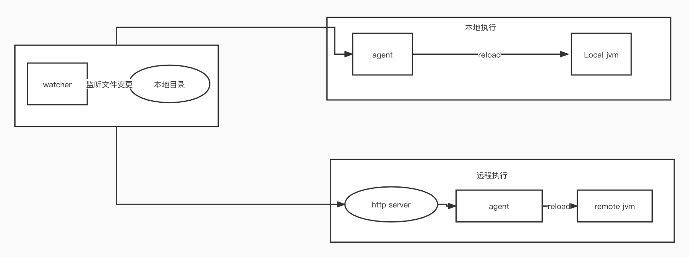

# apisix-plugin-agent

本项目的主旨在于解决[apisix运行时打包](https://issues.apache.org/jira/browse/COMDEV-451)  方便进行开发,支持热更新打包，为ApiSix的每个插件使用隔离的classloader，并实现代码更新


## 功能模块

- apisix-plugin-core: 核心处理逻辑，编译&加载 class 
- apisix-plugin-agent: javaagent 入口
- apisix-plugin-watcher: 监听本地 java 和 class 文件变化，实现本地进程热更新
- apisix-plugin-server: api server，提供接口实现加载远程 jvm 进程

## 架构



## 使用指南


### 本地模式
```bash
# 启动
cd apisix-plugin-agent
sh boot.sh watcher $pid $path1,$path2
```
- pid: java 进程 id
- path: 监听的文件根目录，支持监听 `.class` 和 `.java` 文件，多个目录用`,`分隔

watcher 启动后，可以输入指令完成相关操作，输入 `h` 查看帮助

```
[INFO] input command
h
[INFO] r : 重新加载变更的 Class
[INFO] exit : 退出进程
[INFO] h,help,? : 使用帮助
```

#### `r` 

重新加载所有变更

#### `exit`

退出进程

#### `h`,`help`,`?`

帮助说明


## 编译打包

环境依赖

- jdk 1.8+
- maven

```bash
# mac or linux
make package
```

```bash
# windows
mvn --settings=${maven_settings} clean package -Dmaven.test.skip=true -P full
```

打包完成后的文件保存在 `packaging/target/apisix-plugin-agent-bin.zip`，可以移动到任意目录，解压即可


## 基本原理

1. watcher 监听本地文件变更（.class & .java）并缓存变更文件路径
2. 将变更文件上传到 server 并保存在临时目录（本地模式忽略次步骤）
3. 通过 javaagent 技术 attach 到 jvm 进程，拿到`Instrumentation`对象
4. 使用自定义类加载器（与业务代码隔离）加载 `apisix-plugin-core` 编译 java 文件（如有）
5. 读取 class 文件字节码，通过`instrumentation.redefineClasses()`方法重新定义并加载 class


## 参考项目

- [arthas](https://github.com/alibaba/arthas)
- [lets-hotfix](https://github.com/liuzhengyang/lets-hotfix)
- [HotswapAgent](https://github.com/HotswapProjects/HotswapAgent)
- [one-java-agent](https://github.com/alibaba/one-java-agent)

